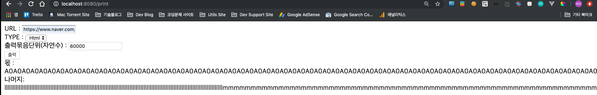
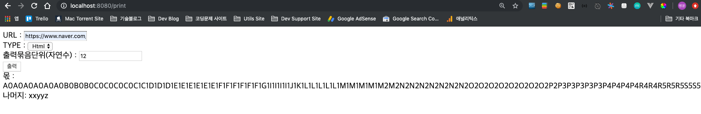

## input
* URL
* TYPE
* 출력묶음단위

## output
* 몫
* 나머지

## 조건
* 모든 문자 입력가능
* 영어, 숫자만 출력
    * html
    * text
* 오름차순
    * 숫자 : 0, 1, 2 ..
    * 영어 : AaBb ..... YyZz
* 영어, 숫자 Mix 교차 출력
* 영어, 숫자, 영어, 숫자 ....
* 출력 묶음 단위
    * input(출력묶음단위) 값 을 참고하여 몫과 나머지 문자를 따로 처리

## 화면

## [html] https://www.naver.com 출력화면

## [text] https://www.naver.com 출력화면
    

수정 필요 사항  
1. 네이밍 규칙 일관성있게 수정해보기.
2. 삭제 필요 주석 및 로직 제거하기.
3. 불필요한 import 제거하기.  
4. IOException을 컨트롤러 메서드 헤더에 선언하여 예외처리.
5. lamda, stream 활용해 보기.
6. swith를 통한 Upper, Lower, Digit를 ENUM을 활용해서 구조화 해보기.
7. Test코드 작성법 공부해서 적용해보기.
8. Front 영역과 Back 영역 RESTful API형태로 변경해보기.